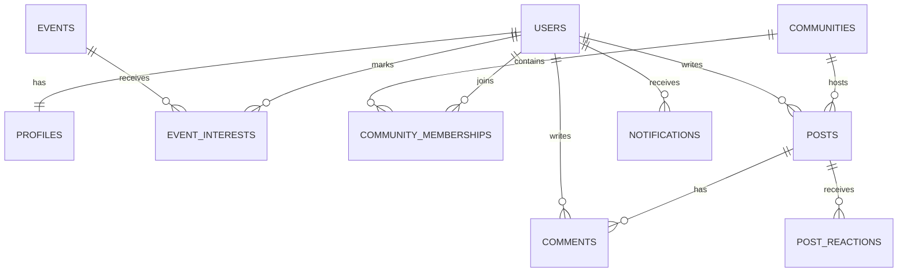

# Schema

Modelo conceptual inicial para Kreis.

## Entidades base

- `users`: identidad funcional del usuario.
- `profiles`: nombre, carrera, foto y datos visibles.
- `events`: eventos publicados.
- `event_interests`: relacion usuario-evento para interes/asistencia.
- `communities`: comunidades disponibles.
- `community_memberships`: relacion usuario-comunidad.
- `posts`: publicaciones dentro de comunidades.
- `comments`: comentarios en posts.
- `post_reactions`: reacciones o score por usuario.
- `notifications`: avisos generados para usuarios.

## Relaciones principales

Este documento es conceptual. Las decisiones finales de tipos, constraints e indices deben quedar en migraciones.
